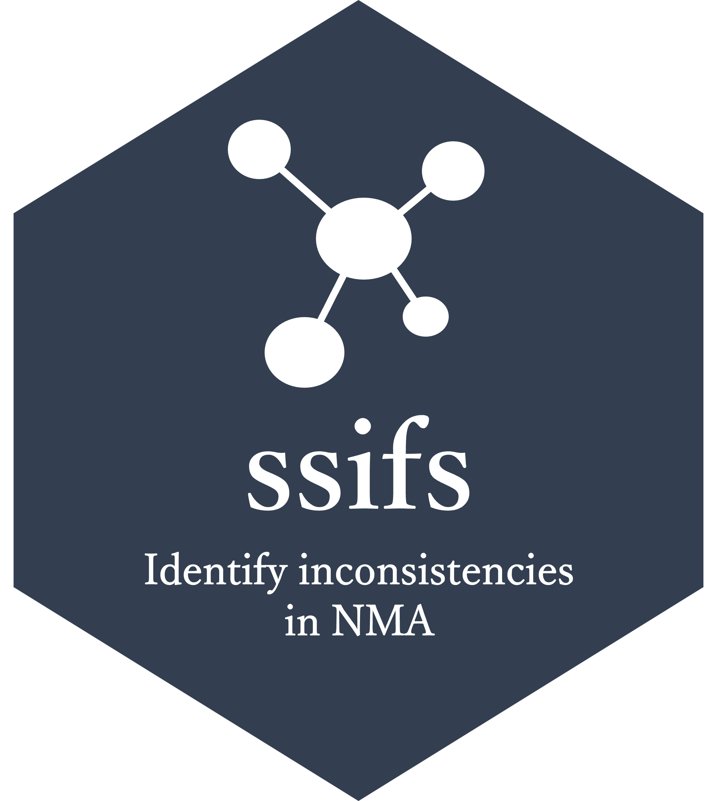

<!-- README.md is generated from README.Rmd. Please edit that file -->

# ssifs

[](https://CRAN.R-project.org/package=ssifs)
[](https://cran.r-project.org/package=ssifs)
[](http://cranlogs.r-pkg.org/badges/grand-total/ssifs)

# 

<!-- badges: start -->
<!-- badges: end -->

The goal of *ssifs* is to test the consistency assumption of network
meta-analysis (NMA) in the Bayesian framework both globally and locally.

## Installation

You can install the development version of *ssifs* like so:

``` r
install.packages("devtools")
devtools::install_github("georgiosseitidis/ssifs")
```

## Usage

We illustrate how to use *ssifs* in the vignette:

``` r
vignette("An_introduction_to_ssifs", package = "ssifs")
```

## Citation

How to cite **ssifs**:

### Publication use

Seitidis G, Nikolakopoulos S, Ntzoufras I, Mavridis D. (2023). *ssifs:
Stochastic Search Inconsistency Factor Selection*. R package version
1.0-2, <https://CRAN.R-project.org/package=ssifs>.

### BibTeX

@manual{, title = {ssifs: Stochastic Search Inconsistency Factor
Selection}, author = {Seitidis, Georgios and Nikolakopoulos, Stavros and
Ntzoufras, Ioannis and Mavridis, Dimitris}, year = {2023}, note ={R
package version 1.0-2}, url =
{<https://CRAN.R-project.org/package=ssifs>}, }

## Funding

This work was supported by the framework of H.F.R.I call “Basic Research Financing (Horizontal support of all Sciences)” under the National Recovery and Resilience Plan “Greece 2.0” funded by the European Union - NextGenerationEU (H.F.R.I. Project Number: 015467)

